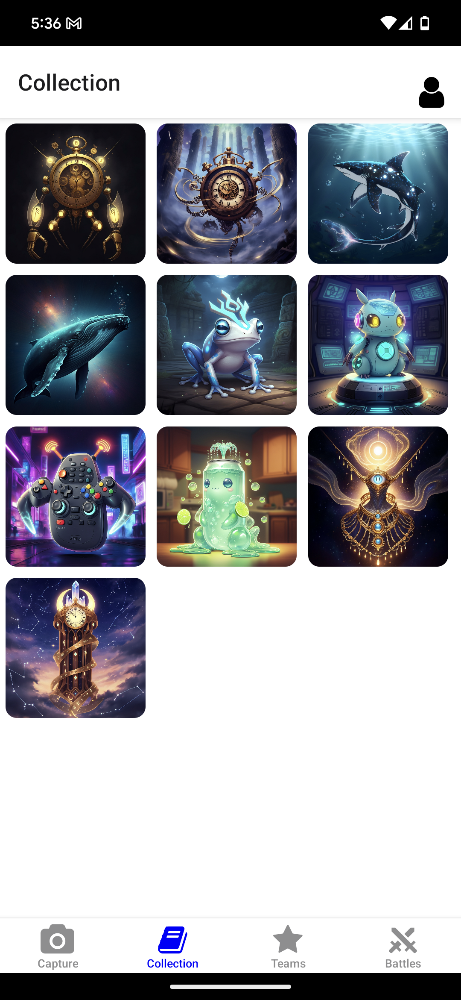
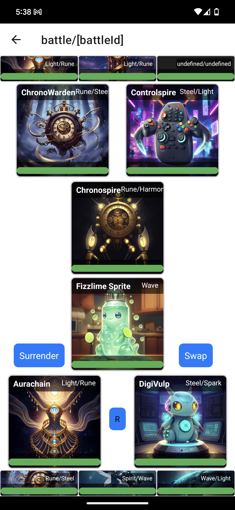

# Spirit Snap


## Gameplay

Spirit Snap is a non-traditional trading card game that allows players to turn any physical object into a playable trading card. Players use their phone camera to capture images of any object. A generative AI pipeline combines image understanding, player context, and gameplay lore to create a unique spirit card. The card includes a customized name, flavor text, relevant types, stats, and abilities. Players form teams of up to six spirits to compete in turn-based battles.

## Demo

| Before | After |
|--------|-------|
|  |  |
|  |  |
|  |  |

## Installation

```bash
# Clone the repository
git clone https://github.com/cryptid-megalodon/spirit-snap.git

# Navigate to the project directory
cd spirit-snap

# Install dependencies
npm install
```
To start the server, see the [server README](server/README.md).

To start the client, see the [client README](client/README.md).

## Features

- Turn any physical object into a playable trading card.
- Collect Cards



- Build Teams


- Battle



## Configuration

To run the project, you will need to bring your own API keys and configure the following environment variables:

In /client/ include a .env file with the following:
```bash
EXPO_PUBLIC_BACKEND_SERVER_URL="" # Address of the server
EXPO_PUBLIC_API_KEY="" # OpenAI API Key
EXPO_PUBLIC_AUTH_DOMAIN="" # Firebase Auth Domain
EXPO_PUBLIC_PROJECT_ID="" # Firebase Project ID
EXPO_PUBLIC_STORAGE_BUCKET="" # Firebase Storage Bucket
EXPO_PUBLIC_MESSAGING_SENDER_ID="" # Firebase Messaging Sender ID
EXPO_PUBLIC_APP_ID="" # Firebase App ID
EXPO_PUBLIC_MEASUREMENT_ID="" # Google Analytics ID
```

In /server/ include a .env file with the following:
```bash
GOOGLE_CLOUD_PROJECT_ID="" # Google Cloud Project ID
AUTH_DOMAIN="" # Google Auth Domain from Google Cloud Console or Firebase
MESSAGING_SENDER_ID="" # Google Firebase Messaging Sender ID
MEASUERMENT_ID="" # Google Analytics ID
```

## API Reference

See [server/README.md](server/README.md) for API reference.

## Contact

Personal Website: [https://blakewolf.me](https://blakewolf.me)

Project Link: [https://github.com/cryptid-megalodon/spirit-snap](https://github.com/cryptid-megalodon/spirit-snap)
